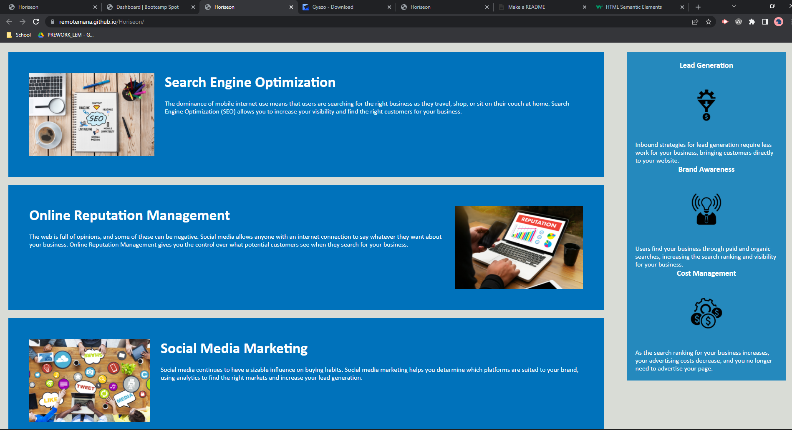

# Horiseon


1. `(HTML)` Renamed div tags to accessible standards 
   ```
   a. assigned Header, Main, and Footer
   b. assigned sections within Header (nav) and Body (article, aside)
   c. added classes and ids to tags to help consolidate CSS elements
   d. fixed broken link

   ```
2. `(CSS)` Cleaned up redundancy
   ```
   a. Consolidated redundant selectors
    -too many header h1
    -.header div ul {} and .header div ul li {}
    -benefit-lead, benefit-brand, benefit-cost
    -benefit h3
    -.online-reputation-management, .social-media-marketing, .search-engine-optimization
    -corresponding img selectors
    -h2 within <aside>
   b. changed class/id/names for selectors to match changes in HTML



